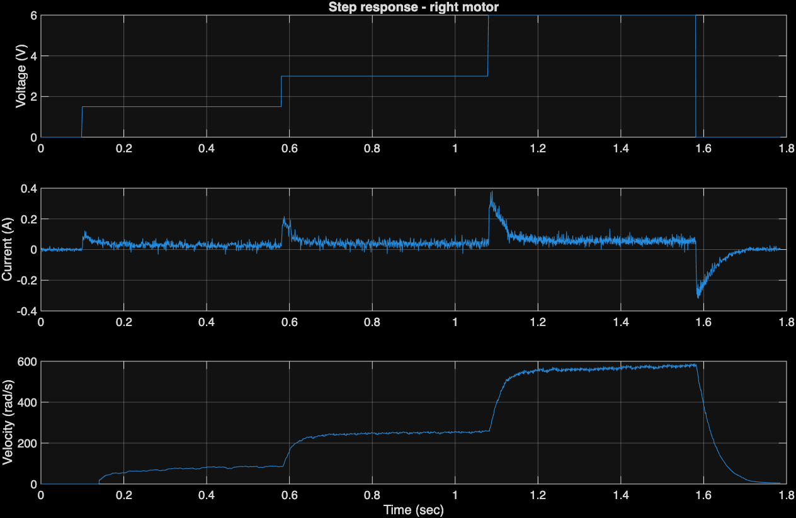
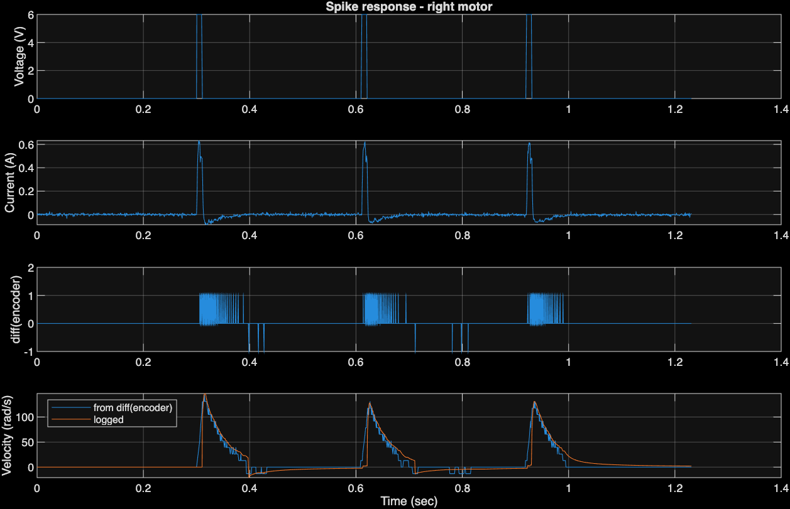
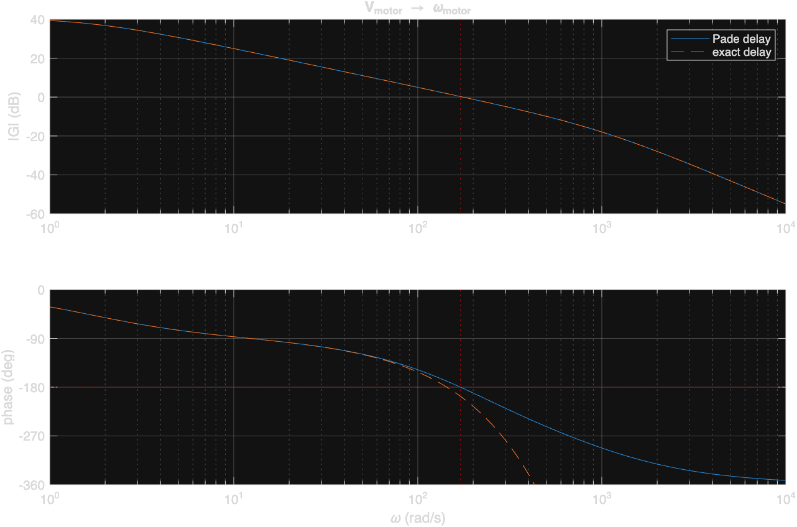
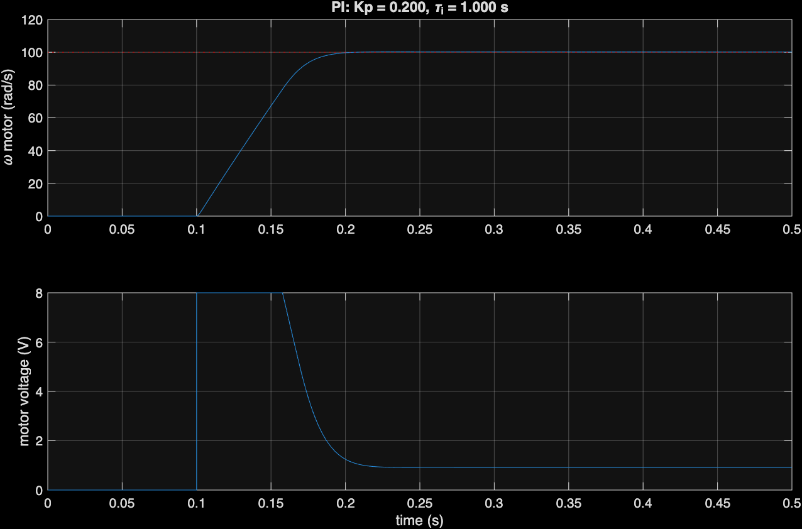

# Lecture 02 – Motor model, transfer function and PI design

Robot **Kim** (74), battery 12.3 V, right motor, wheels off the floor.
Sample time 500 µs, PWM 77 824 Hz.

| Log | Content |
|---|---|
| `logs/device-monitor-260917-114607.log` | step sequence (first run in file is used) |
| `logs/device-monitor-260917-120144.log` | spike sequence |

| Script | Does |
|---|---|
| `plotSteps.m` | step sequence plot + steady-state table |
| `plotSpikes.m` | spike sequence plot |
| `motorParams.m` | R, L, Kb, D, J from both logs → `motorParams.mat` |
| `transferFunction.m` | robot mass, delay, total TF, Bode plot, Q1, Q2 |
| `piDesign.m` | PI design, Simulink test (`motorPI.slx`) → `piDesign.mat` |

> Earlier logs (robot Dicte, `260909-*`) are not used: the PWM frequency was an
> integer multiple of the sample rate, so the current was aliased (negative
> while motoring), and Dicte's battery column read 5.2 V, so it never got 6 V.

---

## 1. Robot model (ex robot mass)

### Step sequence (1.5 V, 3 V, 6 V, 0.5 s each)

Steady state (mean of the last 0.2 s of each step):

| V (commanded) | i (A) | ω (rad/s) |
|---|---|---|
| 1.5 | 0.026 | 83.1 |
| 3.0 | 0.039 | 252.5 |
| 6.0 | 0.055 | 572.7 |

### Spike sequence (3 × 6 V, 10 ms, 300 ms apart)

- The current rises to a stall current of **0.605 A** in about 3 ms (L/R). The motor
  only starts moving after 2.5–5.5 ms (static friction).
- At 0 V the driver **brakes** (shorts the motor), so the current goes negative
  after each spike. The current reading while braking is not consistent with the
  driven samples, so only driven samples are used.

### Model

- Electrical: V = R·i + L·di/dt + Kb·ω + V₀
- Mechanical: Kt·i = J·dω/dt + D·ω + T_c, with Kt = Kb

V is the **commanded** voltage (the firmware adds 0.4 V and compensates for a 1 V
driver loss). V₀ is the residual offset. T_c is Coulomb friction. Both are
constant offsets and not part of the linear model; the integrator in the
controller handles them.

### Method (`motorParams.m`)

1. **R, Kb, V₀:** least squares on V = R·i + Kb·ω + V₀ using the three
   steady-state points and the stall point (ω = 0, i = 0.605 A at 6 V).
2. **D, T_c:** least squares on Kt·i = D·ω + T_c over the steady-state points.
3. **L:** per spike, integrated electrical equation with R, Kb, V₀ known:
   (V−V₀)(t−t₀) − Kb(θ−θ₀) − R∫i dt = L(i−i₀).
   Per spike: 9.23, 9.24, 8.65 mH.
4. **J:** mechanical time constant τ_m of the 3 V and 6 V steps (63 % rise,
   encoder velocity): 25.5 and 30.0 ms. J = τ_m·(Kt·Kb/R + D).

### Parameters

| Parameter | Value |
|---|---|
| R | **9.08 Ω** |
| L | **9.0 mH** (τₑ = L/R = 1.0 ms) |
| Kb = Kt | **0.0087 V/(rad/s) = Nm/A** |
| J (motor, gear, wheel) | **2.4·10⁻⁷ kg·m²** (τ_m = 28 ms) |
| D | **5.1·10⁻⁷ Nm/(rad/s)** |
| V₀ (offset) | 0.51 V |
| T_c (Coulomb friction) | 1.9·10⁻⁴ Nm |

D is small next to the back-EMF damping Kt·Kb/R = 8.3·10⁻⁶, so the exact D value
hardly changes the model.

---

## 2. Transfer function

### Effect of robot mass

Robot mass m = 0.95 kg (robots weigh 940–960 g; no scale available), wheel
radius r = 0.0315 m, gear 9.6.
Each wheel carries half the mass and moves at v = ω·r/gear. Equating kinetic energy,
½·(m/2)·v² = ½·J_r·ω²:

J_r = (m/2)·(r/gear)² = 0.475·(0.0315/9.6)² = **5.11·10⁻⁶ kg·m²**

J = J_motor + J_r = 0.24·10⁻⁶ + 5.11·10⁻⁶ = **5.36·10⁻⁶ kg·m²**

The robot mass is about 20× the motor inertia.

### Motor transfer function

G(s) = Kt / ((L·s + R)(J·s + D) + Kt·Kb)
     = 0.00868 / (4.84·10⁻⁸ s² + 4.87·10⁻⁵ s + 8.0·10⁻⁵)

- DC gain ≈ 108 (rad/s)/V
- Poles at ≈ 1.6 rad/s (mechanical, with robot mass) and ≈ 1000 rad/s (electrical)

### Effect of measurement delay

A pure delay e^(−sT), T = 10 ms, is not rational. Usable approximation, 1st order Padé:

G_delay(s) = (1 − s·T/2) / (1 + s·T/2) = (1 − 0.005 s) / (1 + 0.005 s)

Its gain is 1 at every frequency and it adds only phase lag, like the real delay.
It matches the exact delay up to about 100 rad/s.

### Total transfer function

G_tot(s) = G(s) · G_delay(s)
         = 0.00868 / (4.84·10⁻⁸ s² + 4.87·10⁻⁵ s + 8.0·10⁻⁵) · (1 − 0.005 s)/(1 + 0.005 s)

### Bode plot (motor voltage V → motor velocity rad/s)

**Question 1 – PI-frequency (phase = −180°):**
**ω₁₈₀ ≈ 171 rad/s (27 Hz)** (exact delay: 144 rad/s).

**Question 2 – Is a P-controller with Kp = 1 stable?**
**No, but only just.** |G_tot(jω₁₈₀)| = 1.03 > 1, gain margin −0.3 dB
(exact delay: 1.23, −1.8 dB). Stable only for Kp < 0.97 (Padé) / 0.81 (exact delay).

---

## 3. Controller design

### Design considerations

- **Steady-state error for a step?** With a P-controller, yes: the plant is type 0,
  so e_ss = 1/(1 + 108·Kp), about 4 % at Kp = 0.2. There are also the V₀ and
  friction offsets. A PI controller adds an integrator and removes the error.
- **Could a D or Lead term improve the response?** Only a little. The 10 ms delay
  limits the bandwidth, and a lead term can only recover part of that phase.
- **Noise:** the velocity is estimated from encoder counts and is coarsely quantized.
  A D or lead term raises the high-frequency gain and would amplify this noise straight
  into the motor voltage. → Plain PI.

### PI design

C(s) = Kp·(τᵢ·s + 1)/(τᵢ·s)

1. Target phase margin 60°, with the PI zero Nᵢ = 3 times below the crossover.
   The PI zero costs atan(1/3) = 18.4° at ωc.
2. Crossover where ∠G_tot = −180° + 60° + 18.4° → **ωc ≈ 25 rad/s**.
3. **τᵢ = Nᵢ/ωc = 0.12 s**
4. **Kp** from |C(jωc)·G_tot(jωc)| = 1 → **Kp = 0.13**

### Simulink test (`motorPI.slx`)

- New inertia J = 5.36·10⁻⁶ kg·m²
- Transport delay 10 ms on the measured velocity
- Saturation ±8 V on motor voltage and integrator
- Step at 0.1 s, final value 100 rad/s
- Simulation time 0.5 s

The textbook design overshoots by about 24 %. With the robot mass the plant is almost
an integrator (pole at 1.6 rad/s), so a PI zero close to ωc gives a large
overshoot. The 8 V saturation makes it worse. Sweep (1 s simulation):

| Kp | τᵢ (s) | Overshoot | Settling (2 %) |
|---|---|---|---|
| 0.13 (design) | 0.12 (design) | 24 % | 370 ms |
| 0.20 | 0.05 | 29 % | 190 ms |
| 0.10 | 0.50 | 1.7 % | 150 ms |
| **0.20** | **1.0** | **0.2 %** | **87 ms** |
| 0.30 | 2.0 | 1.9 % | 76 ms, slow tail |
| 0.40 | 1.0 | 7.4 % | 230 ms |

### Final values

**Kp = 0.2, τᵢ = 1.0 s**

- Crossover 36 rad/s, phase margin 69°, gain margin 13.7 dB
- The voltage saturates at 8 V for the first ~60 ms, then settles at ~0.9 V
- The slow integrator only has to remove the small offsets (V₀, friction)

Saved in `piDesign.mat` (R, L, K, Jm, Jr, J, D, T, num, den, pn, pd, PM, Ni, wc,
KpDesign, tau_iDesign, Kp, tau_i, Vmax) for the discrete-time extension.
